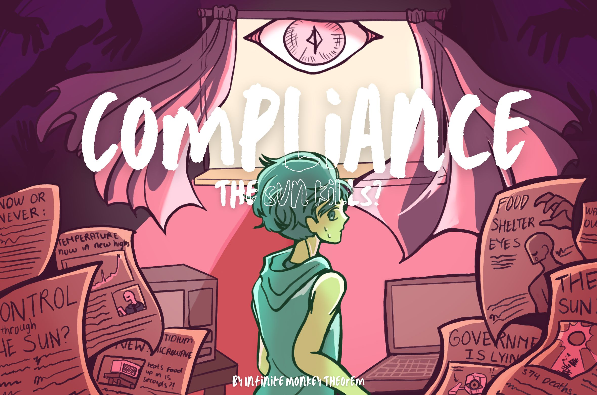

## Compliance

This is a top-down 2D game with elements of survival and management where you're stuck in a room, forbidden by the government from ever seeking sunlight.
Game

Your bedroom is now your world. Trapped inside due to government mandate, you need to manage your hunger, sanity, and room temperature in order to survive. You can achieve survival by doing different actions in your room: Playing video games will decrease the sanity count, eating will remove hunger, opening the window will help you cool yourself, but is strictly prohibited by the government. Find out what happened, discover secrets, and most importantly, Survive.

## Keybinds

The game does not support gamepad and it only playable by using a keyboard and a mouse.

| Keyboard Key | Action |
| --- |---|
| <kbd>W</kbd> | Move Up |
| <kbd>S</kbd> | Move Down |
| <kbd>A</kbd> | Move Left |
| <kbd>D</kbd> | Move Right |
| <kbd>SPACE</kbd> | Interact |

## Assets

All of the sprites were created by our team. The only exception are the sound effects and some music that were found on this websites:

https://pixabay.com/users/eaglaxle-53749042/ https://pixabay.com/users/u_hn60smked5-30463810/ https://pixabay.com/users/xtremefreddy-32332307/ https://pixabay.com/users/universfield-28281460/ https://pixabay.com/users/oxidvideos-37598254/ https://pixabay.com/users/freesound_community-46691455/

## Team

The game was created by 4 people in total. Here you can find links to their itch, GitHub, or portfolio accounts.

Lenster025 - The creator of the game engine that we used. [GitHub]('https://github.com/KedengKedeng')

Stanislav Didus - Worked on the gameplay of the game, sound design, writing, and team management. [GitHub]('https://github.com/StanislavDidus'), [Itch.io]('https://ilikestas.itch.io/')

Solariouse - Main 2D artist, came up with the idea of the game and helped with brainstorming. [Linktr]('https://linktr.ee/solariouseart')

Matty - Helped with art, made the main menu song for the game. [ArtStation]('https://www.artstation.com/matty_arts') 

## How to build the game

- clone the repository
- configure and build by using CMake \
  ` cmake --preset {configure-preset}` \
  `cmake --build --preset {build-preset}`\
  You can list all avaiable presets by using this command
  `cmake --list-presets`
- then go to `/out/{configure-preset-name}` and run `COZY_GAME` \
  If configuring with Visual Studio you might also need to go the directory of the chosen configuration (Debug, Release, or RelWithDebInfo)
